# Support Prototype — AI-агент технической поддержки

Прототип AI-агента для службы поддержки с диалоговой памятью, RAG (Qdrant) и бизнес-сценарием **«Начисление бонусов ко дню рождения»**

Агент:
- отвечает на основе базы знаний (RAG)
- ведёт диалог с учётом истории и summary
- выполняет сценарий ДР **только при явном интенте пользователя** и **только на первом сообщении диалога**
- честно сообщает об отсутствии информации и предлагает эскалацию
- различает диалоги по `conversation_id`

---

## 🧠 Архитектура

- **FastAPI** — HTTP API (`POST /chat`)
- **Qdrant** — векторное хранилище
- **Qwen (через OpenAI-compatible API)** — LLM и эмбеддинги
- **In-memory memory** — история диалога + summary
- **RAG** — поиск по базе знаний
- **Scenario Runner** — JSON-сценарий с `tool / if / text / end`

## 📁 Структура проекта

```text
app/
├── llm/
│   ├── __init__.py
│   ├── client.py        # LLM-клиент (Qwen3)
│   └── embeddings.py    # Клиент для получения эмбеддингов
│
├── parser/
│   ├── __init__.py
│   ├── kb_html.py       # Парсинг HTML-файла базы знаний
│   └── chunker.py       # Разбиение документов на чанки
│
├── rag/
│   ├── __init__.py
│   ├── retriever.py     # Поиск релевантных чанков в Qdrant
│   └── answer.py        # Генерация ответа на основе чанков и контекста
│
├── scenario/
│   ├── __init__.py
│   ├── runner.py        # Движок сценария «Начисление бонусов ко дню рождения»
│   └── tools.py         # Tools (get_user_data — stub)
│
├── main.py              # FastAPI-приложение и endpoint POST /chat
└── memory.py            # In-memory память диалога и summary
│
data/
└── test.html             # Пример базы знаний (HTML)
│
scripts/
└── export_kb_chunks.py  # Утилита для генерации чанков (часть пайплайна RAG)
```
---

## ⚙️ Требования

- Python 3.10+
- Docker + docker-compose
- API KEY(llm + embeddings)

---

## 🔐 Переменные окружения

Создай файл `.env` и заполни значения

**Важно:** проект не содержит секретов. Для работы нужен API-ключ LLM - указывайте свой ключ в `.env`

Пример `.env`:

```env
API_KEY=your_api_key
OPENAI_BASE_URL=https://foundation-models.api.cloud.ru/v1
QWEN_CHAT_MODEL=Qwen/Qwen3-Coder-480B-A35B-Instruct
QWEN_EMBED_MODEL=Qwen/Qwen3-Embedding-0.6B

QDRANT_URL=http://localhost:6333
QDRANT_COLLECTION=kb
```
## 🗄 Запуск Qdrant
Для работы RAG требуется запущенное векторное хранилище Qdrant
Запуск через docker-compose:

```bash
# start
docker compose up -d

# test
`curl http://localhost:6333/healthz`
```
## Индексация базы знаний (RAG)
```python
python -m scripts.export_kb_parsed # Парсинг HTML-документа базы знаний
python -m scripts.export_kb_chunks # Разбиение документов на чанки
python -m scripts.export_kb_vectors # Построение эмбеддингов
python -m scripts.ingest_qdrant # Загрузка в Qdrant
```

## Запуск API
`uvicorn app.main:app --reload`

адрес по умолчанию
`http://localhost:8000`

## Пример запроса
```bash
curl -X POST http://localhost:8000/chat \
  -H "Content-Type: application/json" \
  -d '{"conversation_id":"c1","message":"Подскажите пожалуйста, есть ли у меня аннулированные чеки?"}' | jq
```
## Результаты тестирования

Ниже приведены скриншоты логов и ответов API, демонстрирующие корректную работу агента в различных сценариях, включая граничные случаи

### 🔹 Обычный RAG-запрос
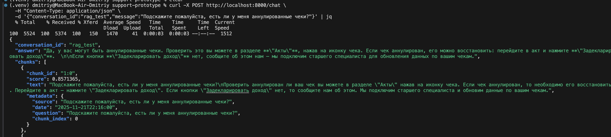

Ответ формируется строго на основе базы знаний без запуска сценариев

---

### 🔹 Сценарий «День рождения» 
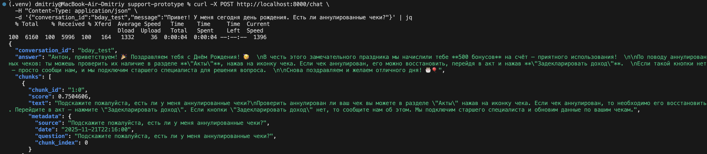

Сценарий запускается на первом сообщении: обращение по имени, поздравление и начисление бонусов + ответ по RAG

---

### 🔹 Намек на День рождение
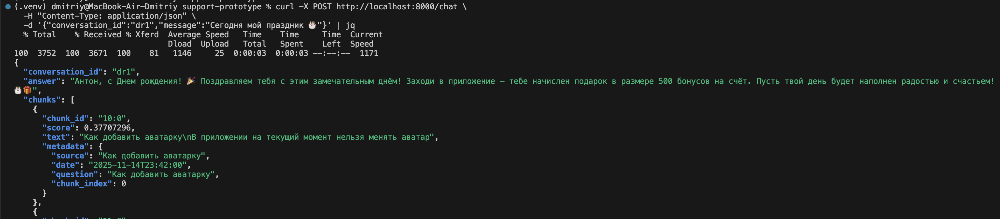

Агент корректно распознаёт интент дня рождения даже в неявной формулировке

---

### 🔹 Ложный интент дня рождения
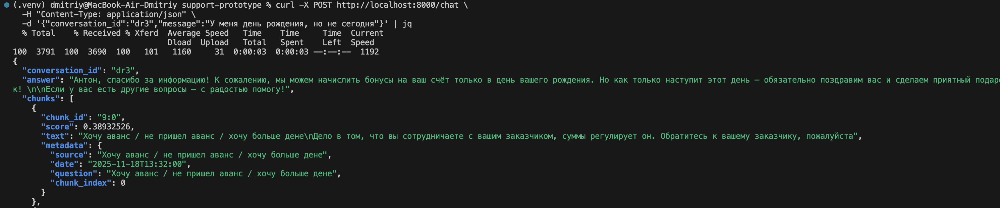

Аген понимает что не сегодня

---

### 🔹 День рождения не сегодня
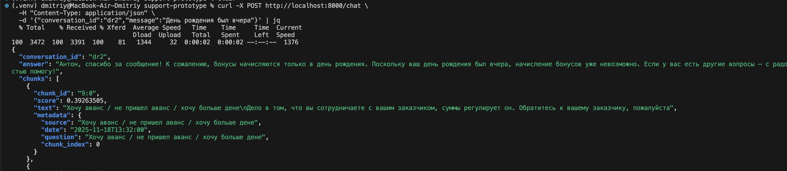

Агент корректно обрабатывает ситуацию, когда день рождения был не сегодня — бонусы не начисляются

---

### 🔹 Trivial-сообщение
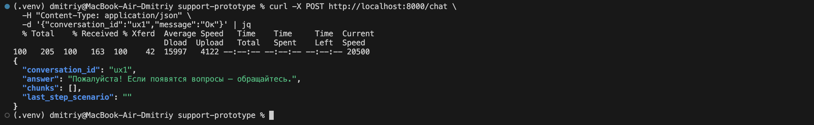

Короткий UX-ответ без запуска RAG и сценариев

---

### 🔹 Проверка памяти диалога (summary)
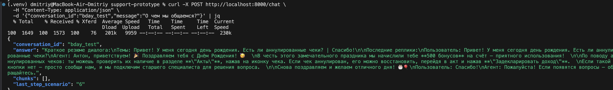

Агент корректно формирует и возвращает краткое резюме диалога по запросу пользователя

---

### 🔹 Мета-вопрос («Кто ты?»)
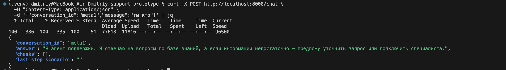

Мета-интенты обрабатываются без обращения к RAG и сценариям

---

### 🔹 Общий запрос
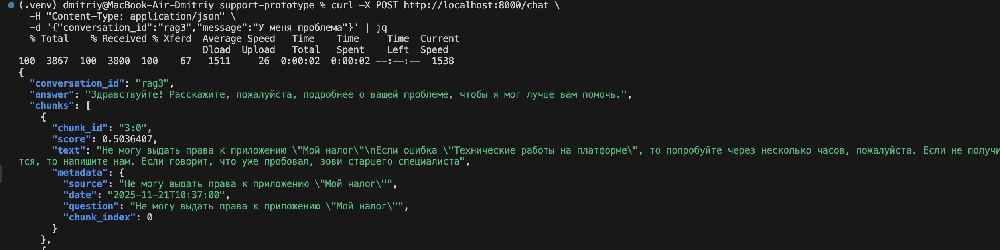

Агент видит общие и неточные темы

---

### 🔹 Стресс-тест пустотой
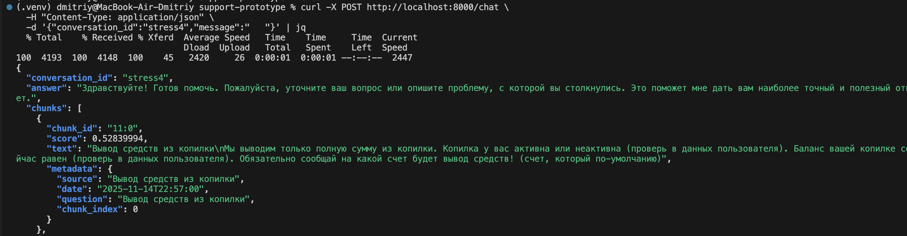

Сервис устойчиво обрабатывает

---

### 🔹 Стресс-тест 2
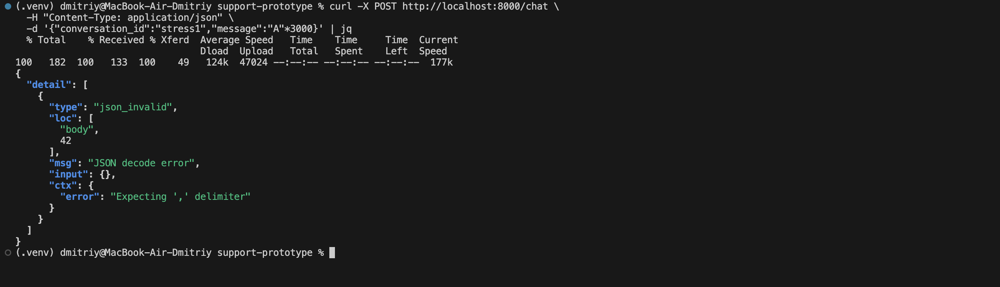

Сервис устойчиво обрабатывает длинные и шумные сообщения без ошибок
